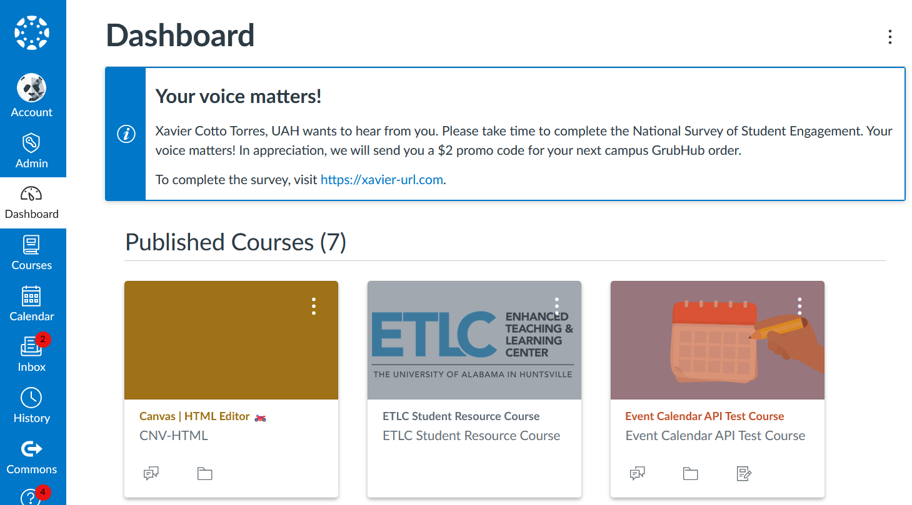

# UAH NSSE Survey Notification Script

## Overview

This script generates a static banner on the student dashboard that cannot be closed. It prompts students to complete the National Survey of Student Engagement (NSSE). The banner includes a personalized message, and upon completion of the survey, a tracking system is in place to monitor participation. 

If any student prefers not to be included in the survey, their details can easily be removed from the `NSSE` and `userUrls` variables. After making changes, simply re-upload the updated JavaScript to the theme editor.

## How It Works

1. **Static Banner**: The script creates a persistent notification on the dashboard that displays a message encouraging students to take the NSSE survey.
2. **Tracking Survey Completion**: The script tracks who has completed the survey, ensuring that no further notifications are shown to students who have already participated.
3. **Personalized Links**: Each student is assigned a unique NSSE survey URL based on their Canvas User ID, which is used in the notification.
4. **Exclusion**: If a student opts out, they can be removed from the `NSSE` and `userUrls` arrays, ensuring they no longer receive notifications.

## Customization

- **Canvas User IDs**: Add or remove Canvas User IDs from the `NSSE` array to control which users see the notification.
- **Survey URLs**: The `userUrls` object maps Canvas User IDs to their unique survey URLs. Customize the URLs as needed.
- **Survey Message**: Modify the message in the banner to fit specific needs or update the incentive (e.g., promo code).

## Preview

### Contact
For any questions or support, please feel free to reach out:

- Email: [xc0009@uah.edu](mailto:xc0009@uah.edu)
- GitHub: [https://github.com/cotitto](https://github.com/cotitto)
- Support:(https://buymeacoffee.com/cotittopr)